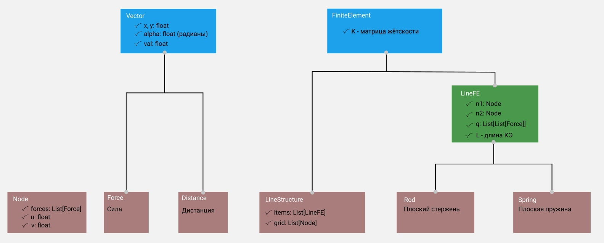

# __FEMCA__
Ультрасовременное ПО для расчёта МКЭ.

# __Как пользоваться__

## Рассчитать файл конструкции

```console
<WORK_DIRECTORY>$ py main.py models/model1.txt
```

## Тесты
```console
<WORK_DIRECTORY>$ py -m unittest discover -v
```

# __Структура проекта__

## [___builds___](builds)
- папка c предпроцессорами, включающая примеры кода python как создать модель

## [___models___](models)
- папка, содержащая файлы модели, которые может принимать программа и потом производить расчёт

## [___results___](results)
- папка, содержащая примеры расчёта моделей, лежащих в папке models

# __fem__
>это пакет, в котором собрана логика программы - её ядро. В пакете расположены следующие модули

## [structure.py](fem/structure.py)
- Модуль предназначен для описания конструкции, состоящей из КЭ



## [matan.py](fem/matan.py)
- модуль предоставляющий математические функции
для работы с матричными выражениями, можно сказать аналог numpy

## [calc.py](fem/calc.py)
- отдельный модуль для расчёта конструкций, отличается от matan тем, что завязан именно на конструкции

## [fio.py](fem/fio.py)
- отдельный модуль для работы с файлами конструкций
