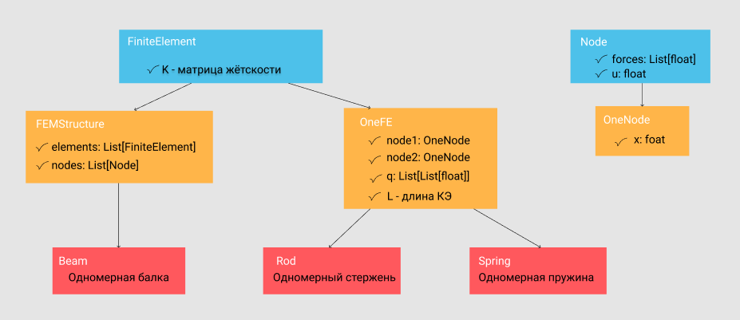

# FEMCA
Самый крутой проект во вселенной.

# fem_tools
это пакет в котором собрана логика программы - её ядро. В пакете распоожены следующие модули

## structure
- Модуль предназначен для описания конструкции, состоящей из КЭ

## matan
- модуль предоставляющий математическеи функции
для работы с матричными выражениями, можно сказать аналог numpy

## calc
- отдельный модуль для расчёта конструкций отличается от matan тем, что завязан именно на конструкции
